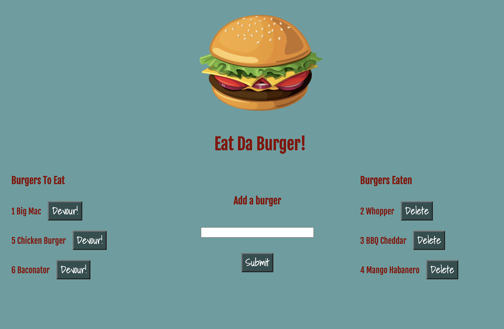

# Eat Da Burger

The Burger app uses Node, Express, Handlebars, and mySQL.

In the browser, the user is presented with a form to add burgers of their choice, which will then show up under a list of "Burgers to Eat" along with a "Devour" button.
When the devour button is clicked, the burger will move to the "Burgers Eaten" list.
Once a burger has been devoured, it can be deleted from the list.

[Click here to check out the app in action.](https://frozen-earth-35238.herokuapp.com/)

